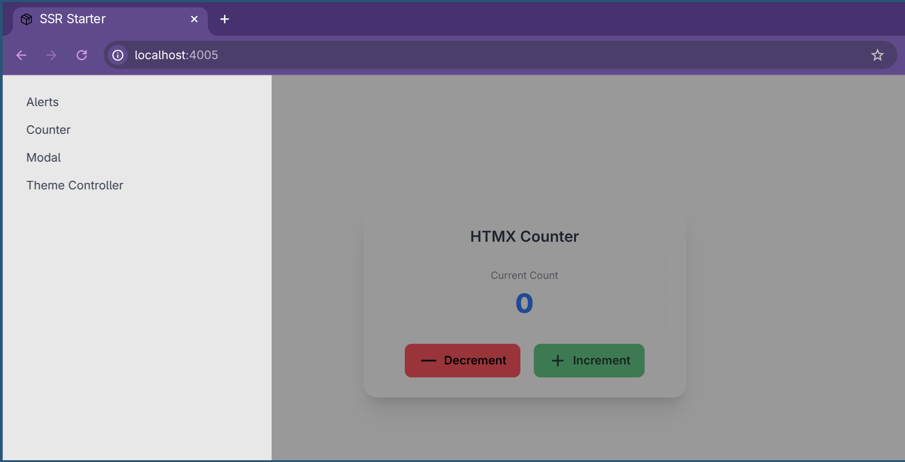

# Server Side Rendered Starter Project



## Prerequesites
- [git](https://git-scm.com/book/en/v2/Getting-Started-Installing-Git)
- [go](https://go.dev/doc/install)
- [task](https://taskfile.dev/installation/)
- [templ](https://templ.guide/quick-start/installation/)
- [air](https://github.com/air-verse/air)
- [bun](https://bun.sh/docs/installation)

## Usage

clone the project
```bash
git clone https://github.com/nanvenomous/ssrStarter.git
cd ssrStarter
```

first time you need to install the web dependencies
```bash
bun install
```

run the project
- you can run the concurrent build and serve the project at `http://localhost:4000`
    ```bash
    task serve
    ```
- **OR** run air (for hot reloading) and go to `http://localhost:4005`
    ```bash
    air
    ```

## Original setup
here are the commands that set up the beginning of this project

this is mostly just to help you create the beginning of this project yourself if you want to
```bash
bun init --yes
rm README.md
bun add -D tailwindcss @tailwindcss/cli daisyui
bun add htmx.org
go mod init github.com/nanvenomous/ssrStarter
cobra-cli init
```
